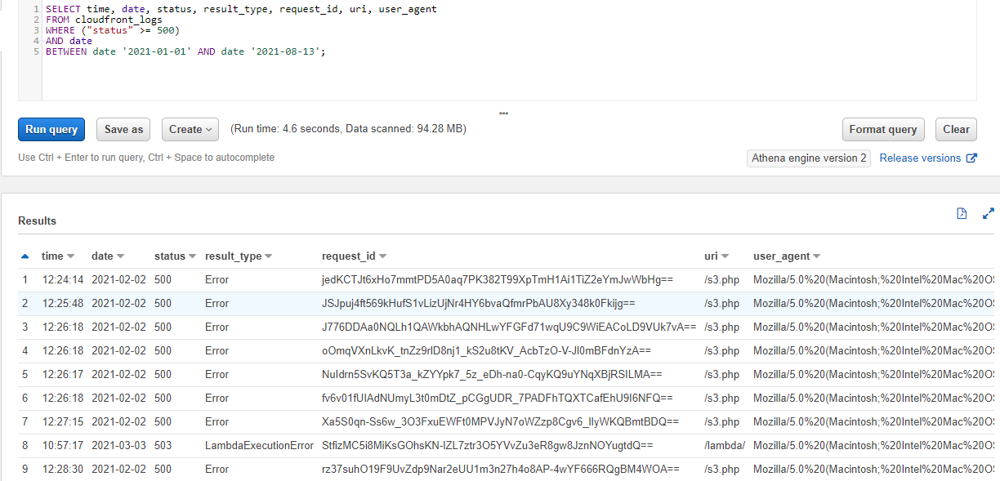
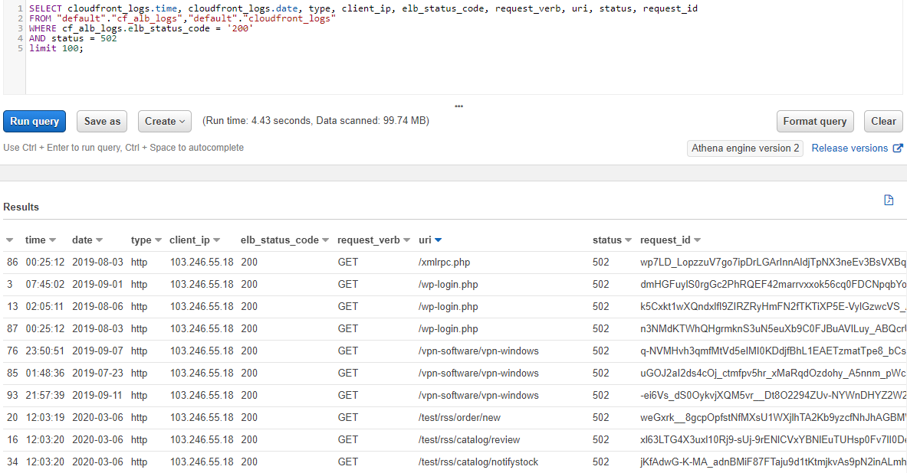
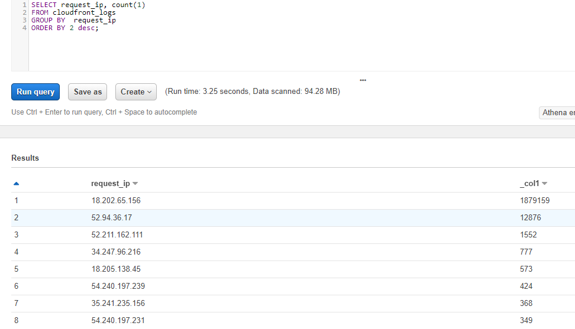

### Athena Queries
Examples of some of the queries executing on Athena.

---
#### Cloudfront 5XX By Specific Date
`CF5xxSpecificDate.sql`
- Change the date as needed.
- Change the `SELECT` fields as desired.

---
#### Show HTTP 502s where ELB saw HTTP 200s
`ELB-200+CF-502.sql`
- Change the status if desired.

---
#### Count Number of Observations of IP Addresses Making Requests
`CFIPRequestCount.sql`
- Not really much to change, I guess perhaps you could set dates maybe?

